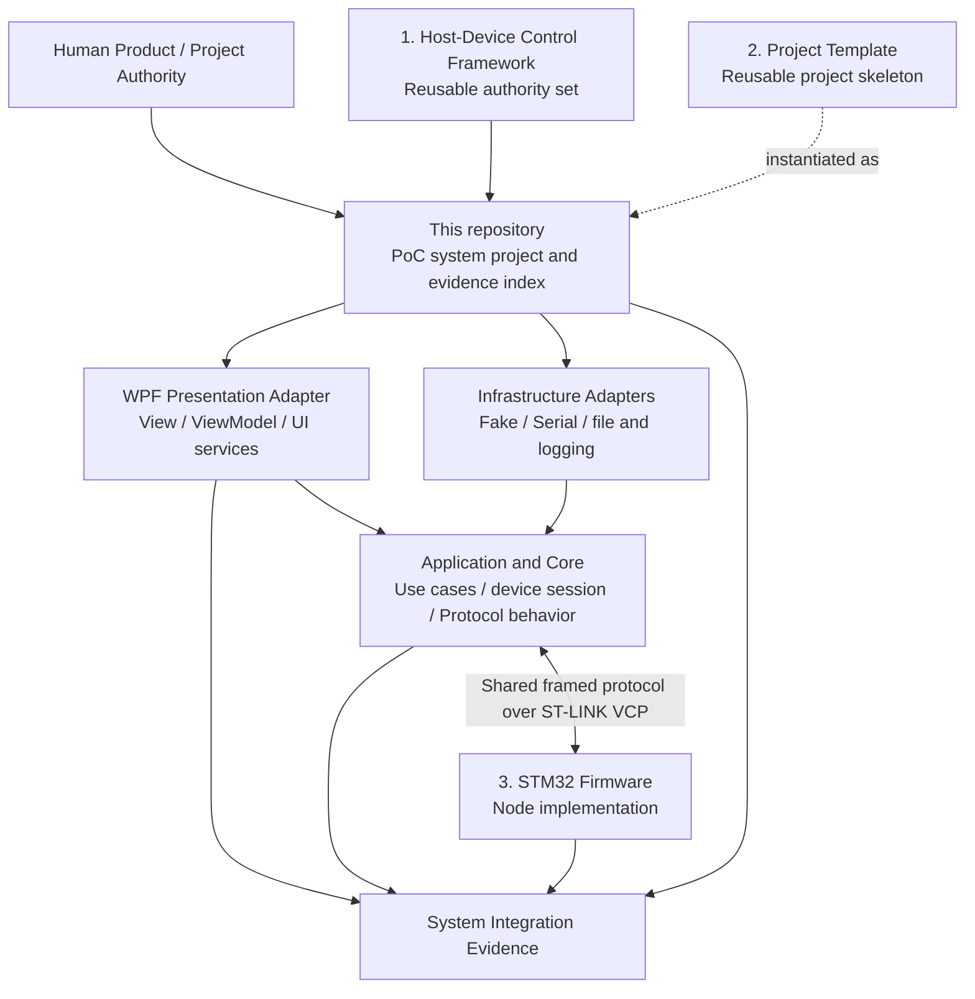

# Host-Device Control PoC System

System-level project guide, repository map, integration baseline, and validation record for the Host-Device Control proof of concept.

This repository binds four related repositories into one traceable engineering project:

1. [`host-device-control-framework`](https://github.com/jkman357/host-device-control-framework) — reusable engineering authority set.
2. [`host-device-control-project-template`](https://github.com/jkman357/host-device-control-project-template) — reusable project workspace template.
3. [`host-device-control-poc-stm32f446re-fw`](https://github.com/jkman357/host-device-control-poc-stm32f446re-fw) — STM32F446RE Node firmware implementation.
4. [`host-device-control-poc-pc-app`](https://github.com/jkman357/host-device-control-poc-pc-app) — Windows WPF Coordinator application.

## Repository Role

This is the **system/project integration repository**. It owns:

- the cross-repository project overview;
- exact source baselines used for a validation cycle;
- the system-level architecture and responsibility map;
- the authoritative shared PC/MCU Protocol contract, test vectors, and synchronization rules;
- build, bring-up, and user guidance;
- system-level V&V planning, results, limitations, and evidence indexing;
- a portable work-continuation record that allows another engineer or AI tool to resume without relying on hidden chat context.

It does **not**:

- replace the reusable Framework;
- duplicate the PC or MCU implementation repositories;
- allow `WORK_CONTINUATION.md`, AI output, a ZIP, or a mutable branch to grant approval, create objective evidence, accept risk, authorize release, or establish Framework conformance;
- claim that a draft, build, simulation, or tool result proves safety, regulatory compliance, production readiness, or Framework conformance;
- convert unexecuted plans or user observations into objective test evidence.

## Current Status

- Current version: `v0.2.2`
- Lifecycle status: `Baseline`
- Previous formal version: `v0.2.1`
- Freeze status: frozen from `v0.2.2-rc.1` by explicit authorized-human approval on `2026-07-29`; exact final Git commit/tag or controlled Release identity remains pending.

This baseline aligns the project with Framework `v1.1.2` and Project Template `v1.1.2`. It defines WPF as the current, replaceable Presentation adapter and protects the Application, Core, Protocol, device-session, and transport-abstraction behavior from direct UI-framework dependency. It does not change the Protocol contract, wire behavior, transport-capacity policy, PC/MCU implementation-gap list, or prior evidence conclusions.

See:

- [`START_HERE.md`](START_HERE.md) — reading and execution entry point;
- [`WORK_CONTINUATION.md`](WORK_CONTINUATION.md) — portable current work state and handoff record;
- [`REPOSITORY_MAP.md`](REPOSITORY_MAP.md) — relationship among all repositories;
- [`QUICK_START.md`](QUICK_START.md) — practical setup and bring-up flow;
- [`VALIDATION_STATUS.md`](VALIDATION_STATUS.md) — current validation dashboard;
- [`docs/VV_Plan.md`](docs/VV_Plan.md) — planned system-level verification;
- [`docs/VV_Results.md`](docs/VV_Results.md) — executed-result register.

## Architecture at a Glance

## Source Baselines

The original project baseline and earlier alignment cycles remain recorded in [`baselines/repositories.yaml`](baselines/repositories.yaml) and are not rewritten by this baseline. A new alignment cycle records the exact supplied Framework `v1.1.2` and Project Template `v1.1.2` package identities used for this Presentation-boundary update. A mutable `main` branch or detached ZIP is not an immutable validation identity. Each controlled validation cycle shall ultimately identify exact commits or controlled tags.

Repository text files are canonically LF. [`.gitattributes`](.gitattributes) enforces LF checkout behavior across supported platforms and identifies binary artifacts that shall not be normalized.

## Shared Communication Contract

The normative communication specification is [`protocol/protocol.yaml`](protocol/protocol.yaml). PC and MCU code are implementations of that contract, not alternative sources of Protocol truth. The current contract remains `candidate_for_alignment`; known differences are tracked in [`protocol/IMPLEMENTATION_ALIGNMENT.md`](protocol/IMPLEMENTATION_ALIGNMENT.md).

## Copyright and Use

Copyright © 2026 Ray Yang. No open-source license is granted. See [`LICENSE`](LICENSE) and [`NOTICE.md`](NOTICE.md).
