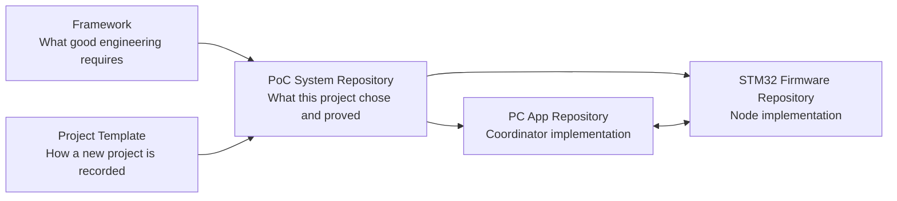

# Repository Map

## Relationship Summary

| Repository | Layer | Primary responsibility | Must not become |
|---|---|---|---|
| `host-device-control-framework` | Reusable authority | Architecture, Protocol governance, Coordinator/Node guidance, coding rules, and evidence boundaries | A Product-specific requirement or proof that a PoC passed |
| `host-device-control-project-template` | Reusable project skeleton | Starting structure for project facts, decisions, approvals, plans, and records | The maintained PoC project itself |
| `host-device-control-poc-system` | System/project integration | Repository map, pinned baselines, shared contract ownership, user guide, system V&V, and evidence index | A duplicate source-code repository or a new normative Framework |
| `host-device-control-poc-stm32f446re-fw` | Node implementation | STM32F446RE firmware, serial transport, frame handling, commands, and telemetry | Owner of the shared system contract by itself |
| `host-device-control-poc-pc-app` | Coordinator implementation | WPF UI, session logic, fake/serial transports, command correlation, display, CSV, and PC tests | Owner of the shared system contract by itself |

## Responsibility Flow

## Why the System Repository Is Needed

Without this repository, the shared project meaning is split across implementation repositories:

- the PC repository currently contains the shared Protocol file;
- firmware and PC source histories advance independently;
- component READMEs cannot by themselves identify which two commits were tested together;
- system-level acceptance criteria and evidence do not naturally belong exclusively to either implementation;
- a successful component build cannot represent end-to-end integration status.

This repository closes that gap by recording the exact cross-repository configuration used for each validation cycle.

## Ownership Rule

Shared project decisions shall be controlled at the system/project layer. Implementation repositories may contain synchronized or generated copies, but shall identify their upstream Protocol baseline and detect drift.
